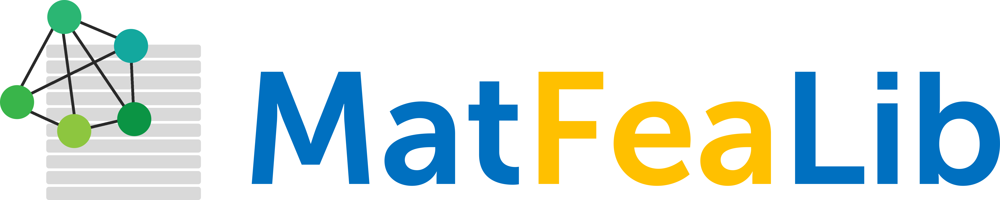

# MatFeaLib

<!-- PROJECT LOGO -->
 

  

**MatFeaLib** (**Mat**erials **Fea**ture **Lib**rary) is a Python library for generating elemental features from materials composition. These representations are often called “descriptors” and can be used in machine learning and data analysis in Materials Science. To get started you can check the basic tutorial.
